# TD de modélisation

## I. COURS

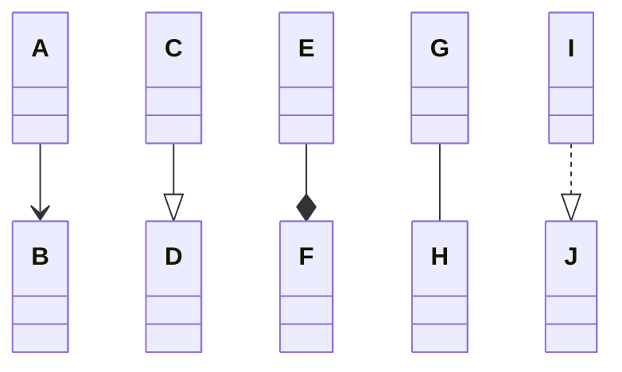

- **A-B** : ??? (svp aider moi je sais pas)
- **C-D** : Héritage (classes)
- **E-F** : Composition (possède)
- **G-H** : Association
- **I-J** : Implémentation (interface)
## II. EXOS

### Exercice 1 : Diagramme de classe, échauffement

**1) Tout auteur a écrit au moins un livre** :

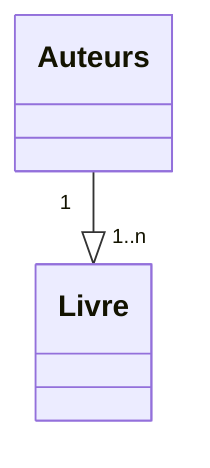

**2) Un rectangle à deux sommet qui sont des points. On construit un rectangle à partir des coordonnées de deux points. IL est possible de calculer son périmètre et sa surface, ou encore le translater**

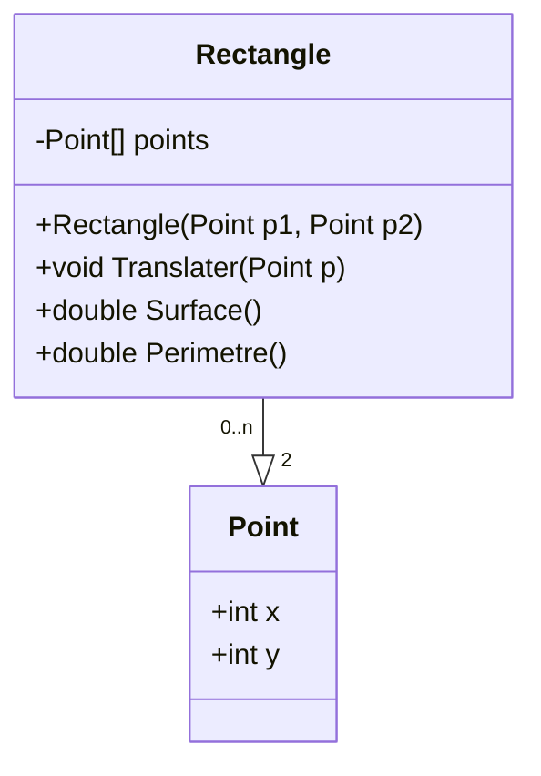

**3) Les personnes peuvent être associées à des établissements en tant qu'étudiants mais aussi professeurs**

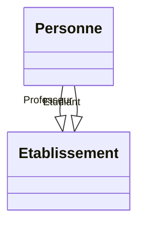

**4) Tout es jours le facteur distribue des plis recommandés dans une zone géographique qui lui est affectée. Les habitants sont également associées à une zone géographique. Les recommandées sont de deux sortes : lettres ou colis. Comme plusieurs facteurs peuvent intervenir dans la même zone, on souhaite, pour chaque recommandé, connaître le facteur qui l'a distribué, en plus du destinataire.**

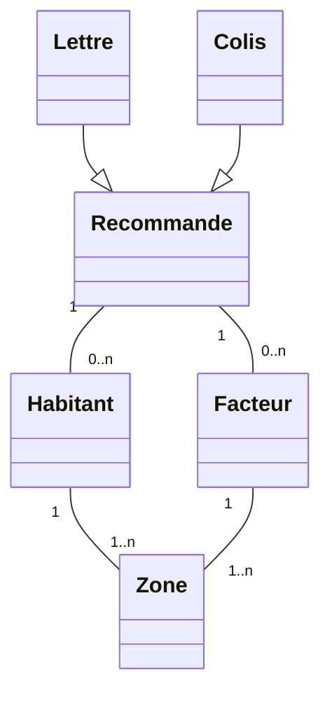

**5) Les cinémas sont composés de plusieurs salles. Les films sont projetés dans des salles. Les projections correspondantes ont lieu à chacune à une heure déterminé (utiliser une classe association)**

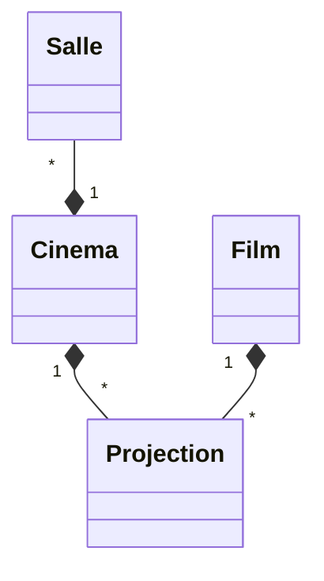

---
### Exercice 2 :  \[Annale d'examen\] Diagrammes de classe, exercice type

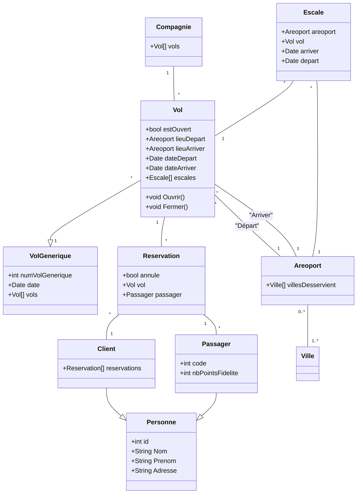

---

## Exercice 3 : \[Annale d'examen\] Modification de diagramme de classe

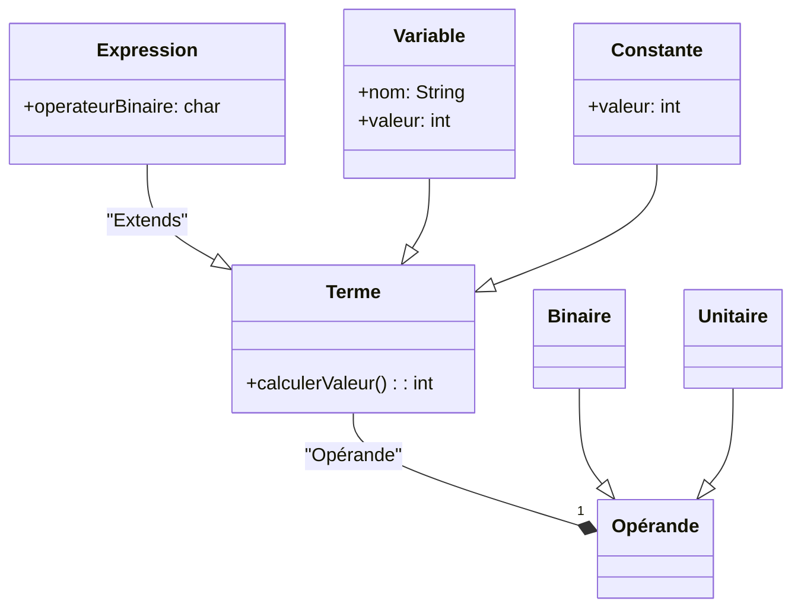
---
### Exercice 5 : \[Annale d'examen\] Du code le diagramme de classe

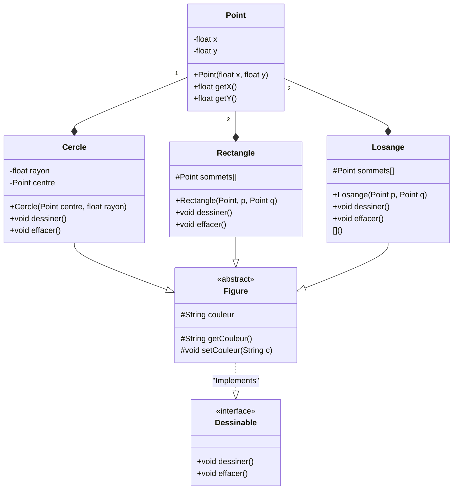

---

### Exercice 6 : \[Annale d'examen\] Diagramme d'états-transition

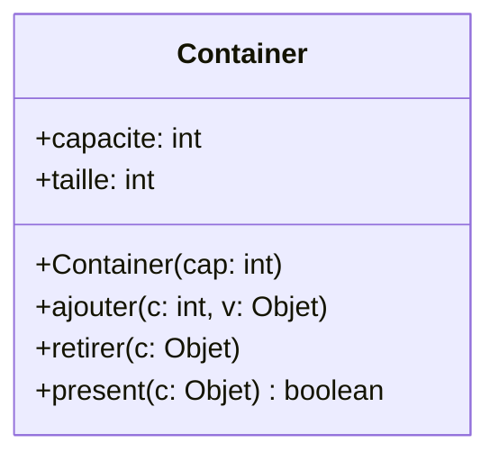

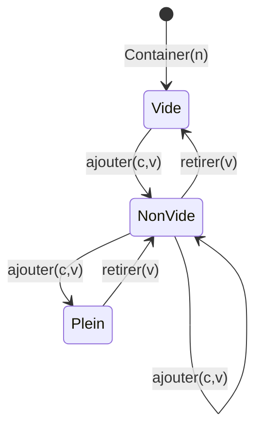
- Pas oulbier aussi qu'on peut retirer si meme si le container est vide (mais ne fait rien dans ce cas)
- Pas oulbier aussi qu'on peut ajouter si meme si le container est plein (mais ne fait rien dans ce cas)

Donc deux flèche vers eux même mais le rendu après il est moche

---

### Exercice 4 : Diagramme de classe

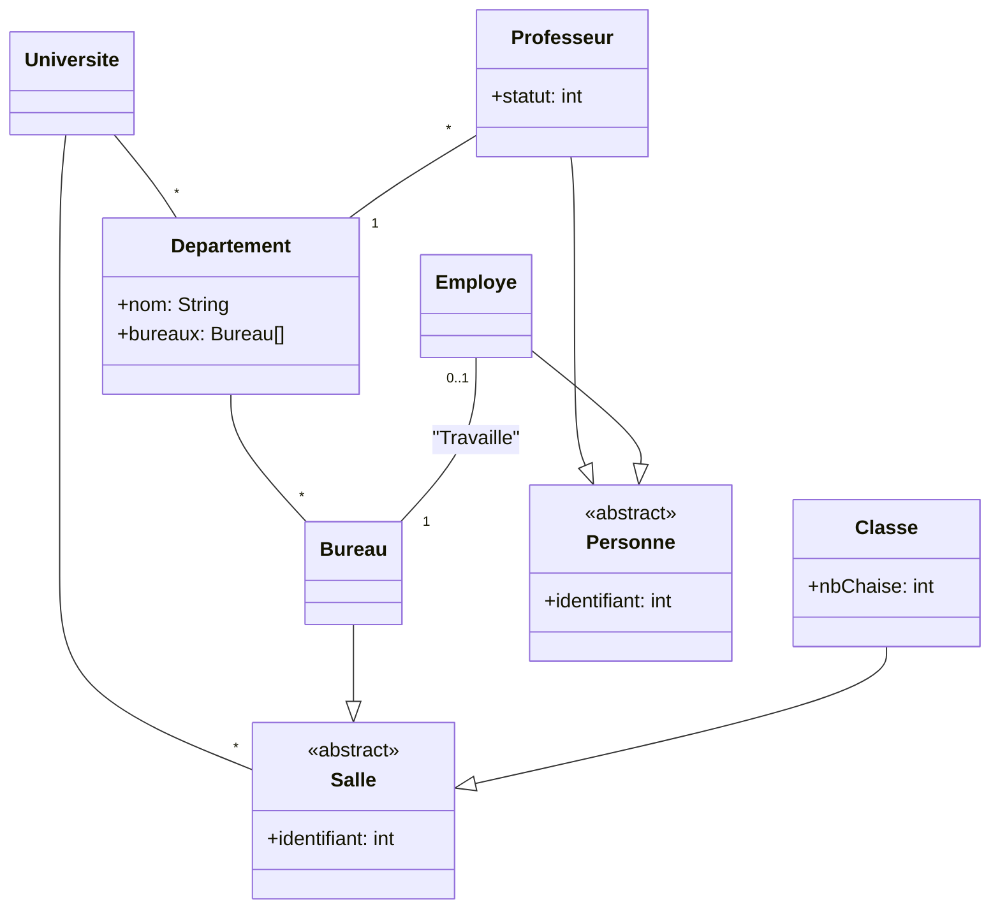

