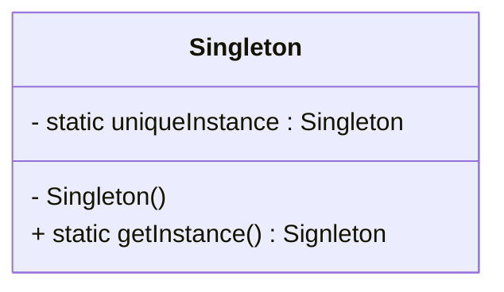

# 5. Patron de conceptions

## Principes de conception logicielle

### Cohésion et Couplage

Elles sont des concepts **abstraits** et **complémentaire** !

*Cohésion*
- A quel point un ensmeble de code est assemblé en un composant cohérent
- A quel point une classe/méthode possède **une reponsabilité (Signle responsability)**

*Couplage*
- A quel point un ensemble de code dépend du code qui l'entoure
- A quel point changer une classe implique de changer les autres.


-> Le but est d'obtenir la plus **forte cohésion** et en meme temps le plus **faible couplage**.

**Exemple** : machine à café qui moud du café (versus 1 machine à café et une machine à moudre)

Avantage ?
- Facile à utiliser (un seul bouton)
- Autofussisante (pas de dépendance à une autres classe)

Invonvénient ?
- Gros code (long à écrire)
- Difficille au *refactoring* (peu modulaire)

-> Faible couplage, faible cohésion

*Comment on peut améliorer ça ?*

- Diviser en sous classes
  - Utiliser de l'agrégation et la composition
  - Bouger le code

Mais askip ça augmente le couplage du coup


**Exemple** : faire du café avec un moulin à café + machine à café

*Avantage*
- Outils spécialisé*
- Partie peuvent etre remplaces

*Invonvénient*
- Difficile à utiliser
- Risque plus éleve de ratage


-> Forte cohésion (*cool*) + Fort Couplage (dépendace entre tout les outils, *pas cool*)

*Comment réduire le couplage ?*

- Réduire le nombre de paramêtre ?
- Utiliser des patrons de conceptions
- Réduire le nombre méthode appelé


**Au final tout est une question de compromis !** 😃
-> *Le Graal : Forte cohésion et faible couplage*


## S.O.L.I.D

- **S**ingle responsability (*ce qu'on as déjà vu avant*)
- **O**pen / Close priniple (*Facile d'ajouter des features, sans cassé l'appli*)
- **L**iskov Substitution (*Héritage entre les classes*)
- **I**nterface Segregation (*Des interfaces avec peu de méthodes*)
- **D**ependency Inversion (*Les classes mère ne dépendande pas de leurs enfants*)

### Single responsability

- Permet d'avoir une meilleur cohésion !
- Plus petite classes, plus facile à implémenter

- Mais fort couplage ...

### Open / close priniple

Laisser la possiblité de faire des extensions

Fermé à la modification
- Ajouter des nouvelles modification ne doit pas modifier le code existant !

### Liskov Substitution

En fait les classes mère doivent comprendre tout les attributs necessaire à créer la classs fille !

Faite attention à vos abastraction (*j'ai compris mais j'arrive pas à expliquer désolé la team force à vous mais je suis sur t'as compris t'es trop fort toi ça se voit* 🥷)

- Ne pas faire d'énorme interfaces

- Privilegier une composition de petites interfaces

- Avec des petites interfaces beaucoup de fonctionnalité offerte
  - Maintenance 😃
  - Testabilité 😃
  - Rusabilité 😃


**Un grand homme à dis** :

"Se baser sur des abstractions, et nin des implantations"

- "J'ai besoin d'un marteau"

Et non

- "J'ai besoin d'un marteau en fer et de couleur bleu"


t'as capté ou pas ? 😎


### Autres bonne ptratiques : DRY !

**D**ont **R**epeat **Y**yourself !

- Ne jamais copier coller de (larges) portions de code

## 2. Les patrons de conceptions (Design patterns)


### Introduction

```
Pour la suite sur l'exemple avec les canard il vaut mieux regarder le diapo !
Il ya beaucoup de choses à noté et c'est pas clair si je l'écris la désolé l'équipe 😔 !!
```

...

Un design patterne décrit une solution à un problème général et récurrent de conception dans un cntexte particulier.

Ils ne sont pas :
- des classes / bibliotheques
- desconcpetion complètes et contrètes, ni une implantation

Elles sont :
- des descriptions abastrates de **solution récurrentes** sur comment résoudres des problèmes **commun**.

### Singleton

**Intention**
- Garantir qu'une classe ne peut avoir qu'une et une seul instance
- Fournir un point d'accès global à cette instance

**Motivation**
- Avoir une seul instance de la varaible global mais qui est **instancier une seul fois!**

**Exemple**

En fait le but ici est de mettre le constructeur privé afin d'empêcher les autres classe d'instancier le singleton. Et la seul façon de récupérer sont instance est à l'aide de sa fonction `getInstance()`



```java
class Singleton {

	private static uniqueInstance Singleton;
	
	private Singleton() {
		...
	}
	
	
		if (uniqueInstance == null)
			uniqueInstance = Singleton();
		return uniqueInstnace;
	}
}
```


**Attention** : Il reste un problème avec le singleton c'est qu'il ne marche pas avec le multi-thread !
- Si on fait le check `if (uniqueInstance == null)` en même temps sur deux thread en même temps alors une instance différentes sera faite sur chacun des threads.


**Solution** :
- Créer le singleton dans l'attribut static directement

```java
class Singleton {

	private static uniqueInstnace = Singleton();
	
	...
	
	public static getIstance() {
		return uniqueInstance;
	}
}
```

- Check en synchronized seulement quand `uniqueInstance` n'as pas été initialiser.

### Factory

Le but est d'éviter la violation du *Open / Close Principle* avec des problème du type :

```java
class PizzaStore {

	public createPizza(String type) {
		
		Pizza pizza;
		
		// Problème dans cette boucle ! On as trop else if !!
		if (type == "greek")
			pizza = new GreekPizza();
		else if (type == "napoli")
			pizza = new NapoliPizza();
		else if ( ... )
			...
		...
			
		pizza.bake();
		pizza.box();
		
		return pizza;
	}
}
```

Ici on as un problème de design *Open / Close* car rajouter un pizza reviens aussi à modifier cette partie de ce code ( la partie else if ) !!!

-> C'est la que le pattern **Factory** intervient !

En fait on déplace tout ça dans la 


```
j'ai pas noter désolé :(
```
