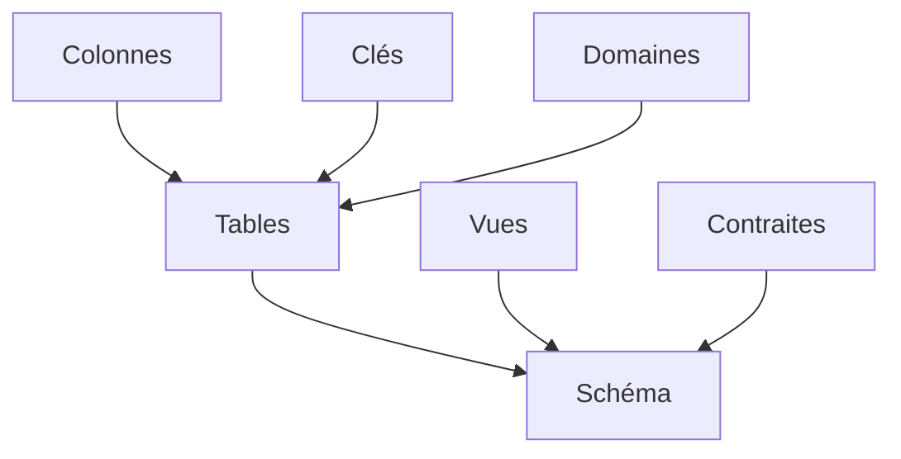

# Introduction Symfony

## Architechure de SGBD

**LDD** : Langauge de définition des Données (CREATE, ALTER, DROP)
**LMD** : Language de manipulation de Données (SELECT, INSERT, UPDATE, DELETE)
**LCT** : transaction (BEGIN, COMMIT, ROLLBACK)
**LCD** : controle (GRANT, REVOKE)


## Métabase

Il ya une la méta-base qui contient toutes les informations sur les bases de données, c'est celle utilisé par l'admin, alors que l'utilisateur parle lui à la base de données précise directement.

- Schéma = descripton du types de donnés contenue dans les BD
- Métabase = schéma organiser sous forme d'une BD relationnel
- Le contenu de la méta-base est manipuler par le LDD.

## LDD : Langauge de définition des données



## Création d'une relation

Créer une relation :

```sql
CREATE TABLE etudiant (descripton);
```

La description est la liste des attributs et des contraintes sur la relation

Défintion d'un attribut :

```sql
nom_attribut TYPE [ NULL | NOT NULL ]
```
```sql
id      CHAR(3) NOT NULL,
nom     VARCHAR(50) NOT NULL,
adresse VARCHAR(150) NULL
```

**Exemple**

```sql
CREATE TABLE etudiant {
    id      CHAR(3) NOT NULL,
    nom     VARCHAR(50) NOT NULL,
    adresse VARCHAR(150) NULL
    PRIMARY KEY (id)
}
```


## Clé primaire

```sql
CONSTRAINT cleEtudiant PRIMARY KEY (id)
```

ou

```sql
PRIMARY KEY (id)
```

## Clé étrangère

```sql
CONSTRAINT fkEtudiant FOREIGN KEY (id_etudiant) REFERENCES etudiant (id),
```

ou

```sql
FOREIGN KEY (id_etudiant) REFERENCES etudiant (id),
```

## Validité d'un attribut

```
CREATE TABLE ... {
    id      CHAR(3) NOT NULL,
    note DECILAM (3, 1) CHECK (note BETWEEN 0 AND 20)
}
```

On rajoute le check après la définition de l'attribut

## Création de Domaine

```sql
CReATE DOMAIN nom_domaine (type de données)
    [ DEFAULT (valeur par défaut)] (contraintre de domaine)
```

Exemple 

```
CREATE DOMAIN num-etape (INTEGER CHECK (VALUE BETWEEN 1 AND 5))
```


## Mise à jour d'une relation

```sql
ALTER tAble NOM_RELATION .. ;
```

```sql
ALTER TABLE suite ADD COLUMN semestre INTEGER
```


```sql
ALTER TABLE nom ADD COLUMN TYPE VARCHAR(50)
```

## Vue

Mécanisme assurant :

- L'indépendance logique
  - Description des données manipulées par une application $\ne$ description logique des relations

- La confidentialité

## Création de Vues

```
CREATE VIEW nom_vue (liste d'attributs) AS (spécification)
```

```sql
CREATE VIEW etudiantAge (id, nom, prénom, age) AS (spécification)
```

```sql
CREATE VIEW clientVIP(numéro, nom, ville, adresse, cumulAnnee)
    AS SELECT n_client, nomCli, adrCli, totCli, FROM client
    WHERE totCli > 1000;
```

## Supression d'une vue


```sql
DROP VIEW (nom de la vlue)
```

## Ajout d'un tuple

```sql
INSERT INTO nom_table VALUES (valeurs);
```

```sql
INSERT INTO etudiant VALUES('001', ...)
```

## Suppression d'un tuple

```sql
DELETE FROM nom_table WHERE condition ;
```

```sql
DELETE FROM etudiant WHERE sexe = 'M' ;
```

## Mise à jour d'un tuple

```sql
UPDATE nom_table SET nouvelle_valeur WHERE condition;
```

```sql
UPDATE etudiant SET nom = 'GALLON' WHERE id = '001';
```

```sql
UPDATE suit SET note = 17.5
    WHERE id IS IN SELECT ( ...)
```
