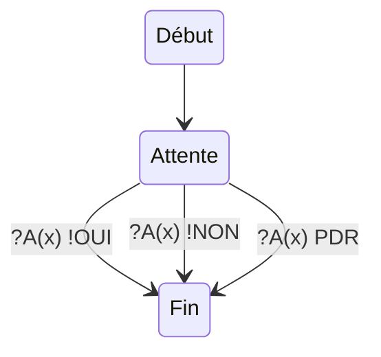
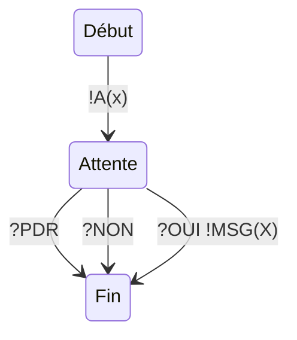

# Partie A. - Principes fondamentaux des protocoles

## Exerice 1. - Modèle en couches

1)

- Application (OSI: 7, 6, 5)
- Transport (OSI: 4)
- Internet (OSI: 3)
- Accès au réseau (OSI: 1, 2)

2) 

- Application : **Message**
- Transport : **Segment**
- Réseau : **Paquet** 
- Accès au réseau : **Trame, Bit**

3)

Services :
- Fonction ou règle d'échange entre les couches sur une même machine-
- Dialogue vertical

Protocoles :
- Les règle d'échange ou de communication entre différentes machine sur une même couche
- Dialogue horizontal

4)

Elle ne voit que ce que la couche N-1 lui fournit. Elle ne connais pas les détails d'implémentation des autres couches.

5)

On fait des changement alors sur la couche transport,
Oui elle impacter car contrairement à TCP le réseau est alors moins fiable.

## Exerice 2 - Analyse protocolaire "aimes-tu"

1)

Serveur :

Client :

2)

Aimes-tu (Bob) <-->Aimes-tu (Léa)

3)

X c'est la couche, et M c'est la machine

Ici on veut voir un dialogue vertical donc :

-  aimes-tu sur M
- transport sur M
- Réseau sur sur M

4)

communication vertical et horizontal
