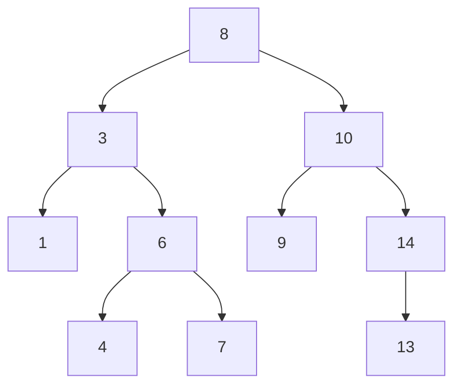

# Arbre de recherche

## Arbres Binaires de Recherche (ABR)

Pour chaque noeud

- Le noeud suivant gauche : Est plus petit
- Le noeud suivant droit : Est plus grand 

Ou vice-versa

### Exemple

Cette arbre est organisé de la façon suivante : 

- Ici les noeuds **gauche sont toujours plus petit** que le noeud parent

- Les noeuds **droit sont toujours plus grand** que le noeud parent

Si on veut trouver la plus petite valeurs alors on va toujour sur le noeud gauche et pour le plus grand sur le noeud droit.

**Problème** : Les arbres ne sont pas toujours équilibrer (donc pour certain élément ça peut être très long et pour d'autres non)

## Arbres h-équilibrer
