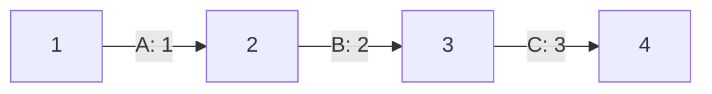
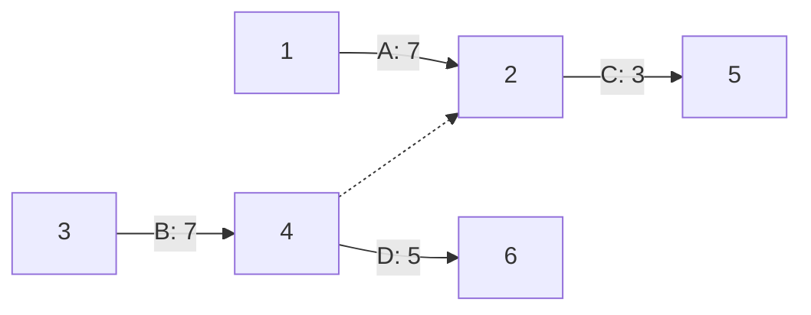

## Méthode potentiel-tache

Construction du graphe :

- A chaque sommet on associe un sommet
- on ajoute deux sommets fictif pour indiquer le ébut et la fin du projet
- On modélise les con ....

En gros c'est un diagramme PERT

### Dates

**Date de début au plus tôt**
- Date auquel on peut commencer une date le plus tot

**Date de début au plus tard**
- La date finale auquel on peut commencer une tache sans créer de retard.

### Marges

**Marge total**
- Le nombre de retard qu'on peut prendre sur une tache sans affecter le retard total du projet

**Marge libre**
- Le nombre de retard qu'on peut prendre sur une tache sans modifié les dates au plus tôt des taches suivantes.

**Marge certaine**
- C'est une marge libre sauf qu'on prend en compte le fait que les tache précédente on été faite au plus tard.

### Chemins

**Chemin critique**
- Chemin qui va du début à la fin du projet en passant que par des taches critiques.

Dans tout graphe des tache il existe au moins un chemin critique qui va du début à la fin.

### Méthde potentiel-tache

On note 

- $d(i)$  : la durée d'une tache $i$
- $t(i)$  : le début au plus tôt d'une tache $i$
- $t^*(i)$  : la date de début au plus tard de chaque tache $i$
- $T-(i)$  : l'ensemble des tache anterieur d'une tache $i$
- $T+(i)$  : l'ensemble des tache postérieur d'une tache $i$

Détermination de la date de début au plus tôt $t(i)$ d’une tache $i$

On part de la tâche de debut qui a 0 comme date au plus tôt. Si la tache i
précède la tache $j$ alors $t^∗_j ≥ t_i + d_i$. On a donc :

$$
t_j = max (t_i + d_i)
$$

### Calcul des marges

Pour une tache $i$ :

- **Marge total d'une tache** $i = t^∗_i − t$

- **Marge libre** $i = min(t_j - t_i - d_i)$

## La méthode P.E.R.T 

C'est une méthode développé dans les années 50 par des chercheurs américain lors de la construction des fusées Polaris.

- A chque tache un associe un arc valué par sa durée.

- Les sommets du graphes, que l'on appelra étapes modéliseront les débuts et fins des taches. A une étape, toute les tache y arrivant seront terminées, et tout celles en partant pourront commencer.

- On ajoute deux sommets fictifs pour représenter les étapes initiales et finales du projet

#### Exemple de diagramme P.E.R.T

Exemple 1 

Exemple 2 

Les points en pointillé représente des taches fictive ! Elle est la pour représenter ne dépendance entre des tâches.

On ne peut pas dupliquer une tache dans un graphe.

## Diagramme de GANTT

