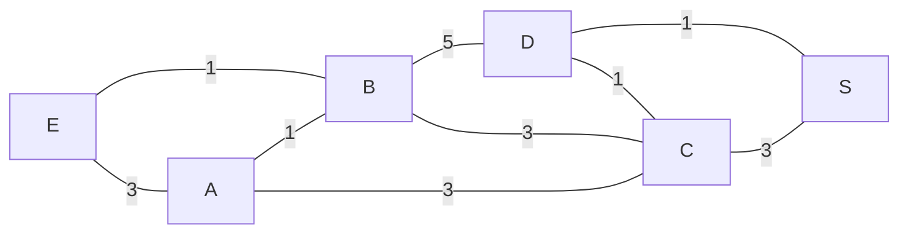
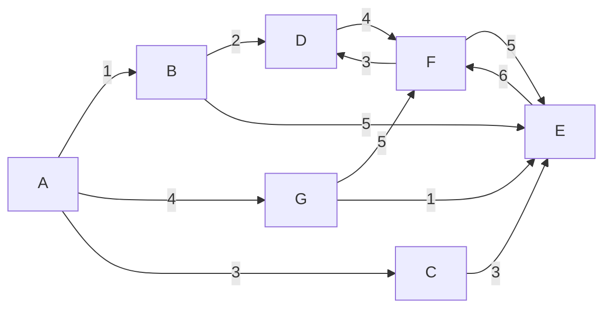
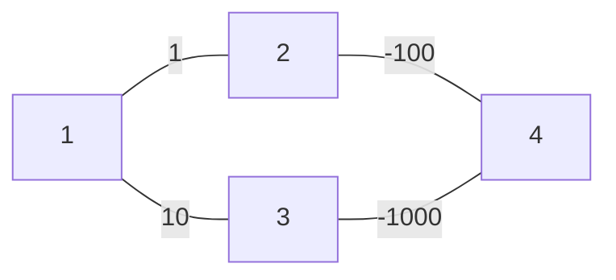

# Plus court chemins dans les graphes

## Algorithme de Djikstra

**Djikstra** (1930-2002) a proposé en 1958 un algo qui donne le plus court chemin d'un graphe donc la compléxité est de $O(n^2)$.

Il est utilisable ue pour les graphe à valuations non-négatives, ce qui implique qu'il n'ya pas de circuit de coût négatif.

### Algorithme

pour tout sommet $v \in V$ faire
> $d[v] \leftarrow \infin, \pi[v] \leftarrow NIL$

$d[s] \leftarrow 0$

$E \leftarrow \empty$

$F \leftarrow V[G]$

```
F = tout les sommets du graphe G
d[v] = distance du sommets v

tant que F != vide faire
    u <- v[d[v]] = min{d[x]|x in F} # On prend le sommet avec la plus petite distance
    F <- F - u # On enleve le sommet u de F
    E <- E + u # On rajoute u dans la liste des sommets

    pour ensuite chaque noeud adjacent[u]
        si  d[v] > d[u] + d(u,v)
        alors
            d[v] = d[u] + d(u, v)
```

**Explication**

On fait un tableau avec tout les sommets, qu'on met touts à une distance de $+ \infin$.

Ensuite on commence alors sur un sommet :

- Tout les sommets voisin qui sont plus proche que $+\infin$ on alors replace dans une nouvelle ligne du tableau


#### Exemple 1




| A         | B         | C         | D         | E         | S         |
|-----------|-----------|-----------|-----------|-----------|-----------|
| $+\infin$ | $+\infin$ | $+\infin$ | $+\infin$ | $+\infin$ | $+\infin$ |
| $3_E$     | $1_E$     | $+\infin$ | $+\infin$ | $0$       | $+\infin$ |
| $2_B$     | $.$       | $4_B$     | $6_B$     | $.$       | $+\infin$ |
| $.$       | $.$       | $4_B$     | $6_B$     | $.$       | $+\infin$ |
| $.$       | $.$       | $.$       | $5_C$     | $.$       | $7_C$     |
| $.$       | $.$       | $.$       | $.$       | $.$       | $6_D$     |


#### Exemple 2




| A         | B         | C         | D         | E         | S         |
|-----------|-----------|-----------|-----------|-----------|-----------|
| $+\infin$ | $+\infin$ | $+\infin$ | $+\infin$ | $+\infin$ | $+\infin$ |
| $0$       | $?$       | $+\infin$ | $+\infin$ | $+\infin$ | $+\infin$ |


### Si il ya des arcs négatifs !


Exemple on as un graphe avec des arrêtes négatives




On pourrais essayer de mettre tout en absolu, mais en fait ça va pas marcher tout le temps,

Il yaura toujours des soucis et tout c'est chiant


## Algorithme de Bellman-Ford

Algorithme de Bellman-Ford aussi appelé Bellman-Ford-Moore1
