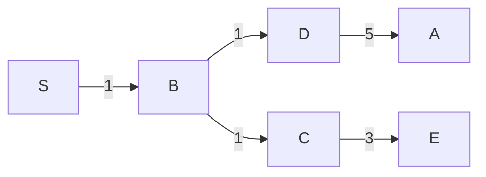
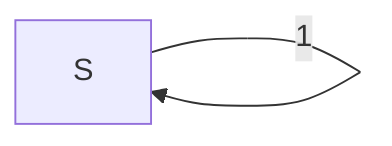

# TD10

## Exercice 1.

1.

2.

3.

| Sommet | S | A | B | C | D | E |
|--------|---|---|---|---|---|---|
| . | 0 | $\infin$ | $\infin$ | $\infin$ | $\infin$ | $\infin$ |
| S | 0 | 7 | 1 | $\infin$ | $\infin$ | $\infin$ |
| B | 0 | 6 | 1 | 3 | 2 | $\infin$ |
| D | 0 | 5 | 1 | 3 | 2 | 5 |
| C | 0 | 5 | 1 | 3 | 2 | 4 |

4.

Pour obtenir le chemin le plus court d'un noeud, il faut partir de la fin du tableau et remonter dans chaque noeud ou il à été modifier.

## Exercice 2

1. 

2.

Ordre des arcs : $(S, B)$, $(S, A)$, $(S, C)$, $(A, B)$, $(B, C)$, $(C, A)$

| Itération | S | A        | B        | C        |
|-----------|---|----------|----------|----------|
| 0         | 0 | $\infin$ | $\infin$ | $\infin$ | 
| 1         | 0 | 2, -2    | 4,3      | 1        | 
| 2         | 0 | -3       | -1       | 0        | 
| 3         | 0 | -4       | -2       | -1       | 
| Fin |   |   |   |   |
| 4         | 0 | -5       | -3       | -2       | 

Ici on voit que même après la fin de l'algo il y a encore une amélioration, donc ça veut dire qu'il ya un **circuit absorbant** !

Donc l'algorithme retourne **FAUX**.

## Exercice 3

