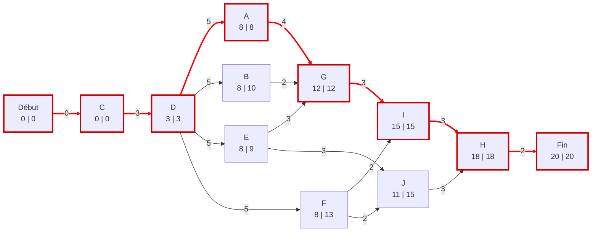
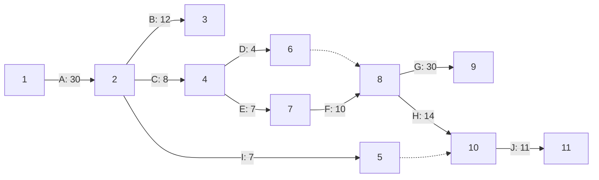
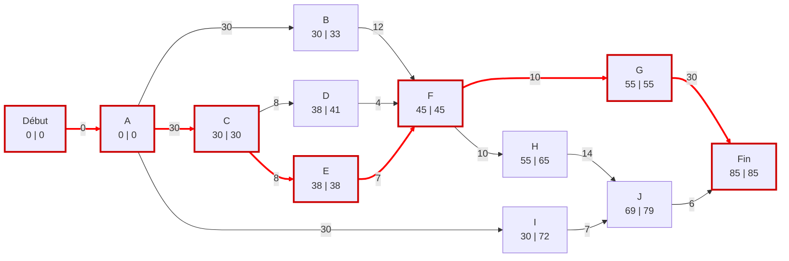

# TD11

### Exercice 1

Marges de chaque taches : 

| Tache | Marge libre |  Marge Total |
| ------| ----------- | ------------ |
| A     | 0           | 0            |
| B     | 2           | 2            |
| C     | 0           | 0            |
| D     | 0           | 0            |
| E     | 0           | 1            |
| F     | 1           | 5            |
| G     | 0           | 0            |
| H     | 0           | 0            |
| I     | 0           | 0            |
| J     | 4           | 4            |

### Exercice 2

**PERT**

YA PAS PERT AU CONTROLE LESGOOO

**Méthode potentielle tache**

Marges de chaque taches : 

| Tache | Marge libre |  Marge Total |
| ------| ----------- | ------------ |
| A     | 0           | 0            |
| B     | 0           | 0            |
| C     | 0           | 0            |
| D     | 0           | 0            |
| E     | 0           | 0            |
| F     | 0           | 0            |
| G     | 0           | 0            |
| H     | 0           | 0            |
| I     | 0           | 0            |
| J     | 10          | 10           |

